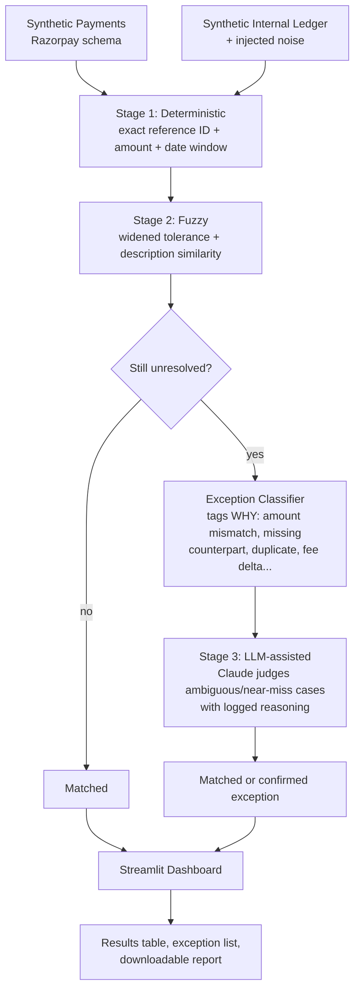

# Multi-Source Reconciliation + Exception Intelligence Engine

Built for the **Razorpay AI Buildathon 2026 — Track 04 (AI Finance Controller)**.

An agent that reconciles a payments source against an internal ledger, closing the loop with a
match rate, a measured accuracy score, and a classified, honest exception list — no cherry-picked
demo runs.

**Live demo:** https://razorpay-recon-agent-bfar8jdwabaejt6qrj9u7u.streamlit.app/
**Repo:** https://github.com/KetineniShanmukh/razorpay-recon-agent

## The problem

Every payment gateway transaction should have a matching entry in a company's internal
bookkeeping ledger. In practice it never lines up cleanly: typos, late-recorded dates, duplicate
entries, amount mismatches from fees, and records that simply don't exist on one side. Someone —
usually a person, by hand — has to work out which records match, which don't, and *why*. This
project automates that loop end to end.

## About the data

Both data sources are synthetic, described honestly as such throughout — not presented as live
data. (The buildathon brief explicitly permits a "50+ record batch of synthetic data.")

- **Payments**: generated locally by [`src/ingest/razorpay_style_generator.py`](src/ingest/razorpay_style_generator.py),
  using the exact field names and structure of Razorpay's real Payments/Settlements API
  (`id`, `entity`, `amount` in paise, `currency`, `status`, `method`, method-specific fields like
  `card_id`/`bank`/`wallet`/`vpa`, `created_at` as a Unix timestamp, `fee`, `tax`, etc. — see
  [razorpay.com/docs/api/payments](https://razorpay.com/docs/api/payments/)). This project doesn't
  call the live Razorpay API — a real dashboard account requires PAN-based KYC, which isn't
  available here — so the generator matches the real schema field-for-field instead of inventing
  its own shape, meaning real API data could be substituted in later with no changes downstream.
- **Internal ledger**: a synthetic ledger derived from those payments with realistic injected
  noise — typos, date drift (including drift deliberately wider than the matching engine's
  tolerance, so some misses are genuine, not a rigged demo), duplicate entries, amount mismatches,
  fee/tax deltas, and rows with no counterpart at all on either side. See
  [`src/ingest/synthetic_ledger.py`](src/ingest/synthetic_ledger.py).
- A hidden **ground-truth answer key** is generated alongside the ledger (which row *really*
  matches which payment) but kept out of the matching engine's input entirely — it exists purely
  to score the engine's output afterwards, which is what makes the accuracy numbers below
  *measured* rather than self-reported.

## Architecture



Each stage only sees what the previous stage couldn't resolve — cheapest and most confident first
(exact ID match), most expensive and judgment-based last (an LLM call). Nothing is ever forced
into a match; anything the pipeline isn't confident about becomes a classified exception instead.

## The matching engine

- **Stage 1 — Deterministic** ([`src/matching/deterministic.py`](src/matching/deterministic.py)):
  exact match on reference ID + amount (tight rounding tolerance) + a 1-day date window.
  Confidence 1.0. Handles most typo-only noise cleanly, since typos live in the description field,
  which this stage doesn't even look at.
- **Stage 2 — Fuzzy** ([`src/matching/fuzzy.py`](src/matching/fuzzy.py)): two passes. Pass A
  retries rows with a reference ID stage 1 rejected, using widened tolerance (6% amount, 5-day
  window). Pass B handles rows with no usable reference ID at all, searching by amount/date
  proximity and disambiguating via fuzzy description similarity — and deliberately refuses to
  guess when the top two candidates score too close to call.
- **Conflict resolution** ([`src/matching/engine.py`](src/matching/engine.py)): enforces that one
  payment can only be claimed by one ledger row. When two rows both plausibly match the same
  payment (a duplicate ledger entry), the higher-confidence one wins and the other is flagged as a
  `likely_duplicate` exception — not silently matched twice.
- **Exception classifier** ([`src/exceptions/classifier.py`](src/exceptions/classifier.py)): every
  row that's still unresolved gets tagged with a real reason, not a bare "unresolved" flag. Covers
  the four categories the buildathon brief names explicitly — `amount_mismatch`,
  `missing_counterpart`, `likely_duplicate`, `currency_fee_delta` — plus two more precise bonus
  categories: `date_drift` (only the date is the problem) and `ambiguous_match` (multiple
  candidates score too close to call automatically).
- **Stage 3 — LLM-assisted** ([`src/matching/llm_resolve.py`](src/matching/llm_resolve.py)): for
  the judgment-call exceptions (`date_drift`, `amount_mismatch`, `currency_fee_delta`,
  `missing_counterpart`, `ambiguous_match`), Claude (`claude-opus-5`) is shown the ledger row, up
  to 3 unclaimed candidate payments, and the classifier's own explanation, then required to return
  a decision with reasoning. Every call's full prompt and response is kept as an audit trail, not
  just the final verdict. `likely_duplicate` is excluded — conflict resolution already has a
  definitive winner there, nothing left to judge.

## Measured results — honest, not cherry-picked

Run across 9 different random seeds (80 payments each), stages 1+2 only:

| Seed | Measured accuracy |
|------|-------------------|
| 1 | 94.4% |
| 2 | 94.0% |
| 3 | 96.4% |
| 7 | 98.8% |
| 13 | 98.9% |
| 42 | 97.6% |
| 99 | 93.1% |
| 123 | 97.6% |
| 2026 | 94.0% |

**Range: 93.1% – 98.9%, average ~96.1%.** This varies run to run because the noise generator
deliberately includes noise stage 1+2 genuinely cannot resolve on their own (date drift wider than
the fuzzy tolerance window) — a first version of this engine scored a suspicious 100% across every
seed, which turned out to mean the matching tolerances were too neatly matched to the noise
ranges (both designed by the same code). Real misses were added on purpose so this number means
something.

Adding stage 3 (LLM-assisted resolution) on seed 42: **97.6% → 100%** measured accuracy — the
genuine date-drift misses got correctly resolved with sound reasoning ("date just recorded late,
same reference ID, same amount"), while true exceptions (ledger rows with no real payment behind
them at all) were correctly *confirmed* as exceptions rather than force-matched.

## Dashboard

`dashboard/app.py` (Streamlit): generate synthetic demo data in-app or upload your own
payments/ledger CSVs → preview → run reconciliation (stage 3 is an opt-in checkbox, since it costs
API calls) → filterable results table → exception list with a breakdown chart → stage 3's full
audit trail, expandable per row → download the full results, exceptions-only, or a plain-text
summary report.

One honesty detail: "measured accuracy" only displays when ground truth exists — i.e. only for
generated demo data. Uploaded real data correctly shows "N/A" instead of a fabricated number.

### Trying stage 3 yourself

Everything in the dashboard is open with no login — generating data, uploading your own files,
running stages 1+2, the results table, the exception list, every download — except one checkbox:
**"Also run stage 3 (LLM-assisted resolution)"** is gated behind a passcode.

That's deliberate, not evasive: stage 3 makes real Anthropic API calls billed to my account, and
the dashboard is a public link with no authentication. Without a gate, anyone who found the link
could spam that checkbox and run up a real bill with no rate limit. The gate fails *closed* — if
the passcode isn't configured at all, stage 3 stays locked for everyone, including me, rather than
defaulting open.

**Passcode: `buildathon2026`** — enter it in the text field above the checkbox to unlock stage 3.
It's not a real secret, just an anti-abuse gate — evaluators should feel free to use it.

## Running it locally

```bash
git clone https://github.com/KetineniShanmukh/razorpay-recon-agent.git
cd razorpay-recon-agent
python -m venv .venv
.venv\Scripts\activate       # Windows; use `source .venv/bin/activate` on macOS/Linux
pip install -r requirements.txt

# Optional: enables stage 3 (LLM-assisted resolution) — copy .env.example to .env
# and add your ANTHROPIC_API_KEY. Everything else works without it.

streamlit run dashboard/app.py
```

Or via the command line, no dashboard:

```bash
python -m src.ingest.generate_data -n 80              # generate synthetic data -> data/generated/
python -m src.matching.run_eval -n 80                  # stages 1+2 only
python -m src.matching.run_eval -n 80 --use-llm         # + stage 3, writes an audit trail JSON
pytest tests/ -v                                        # 31 tests, no API key required
```

## Docker + CI

```bash
docker build -t razorpay-recon-agent .
docker run -p 8501:8501 razorpay-recon-agent
```

GitHub Actions ([`.github/workflows/ci.yml`](.github/workflows/ci.yml)) runs the full test suite on
every push (no API key needed — the stage 3 tests use a fake Anthropic client), then builds the
Docker image and starts a real container, polling Streamlit's health endpoint to confirm it
actually serves traffic before passing.

## Project structure

```
src/
  ingest/         synthetic payments + internal ledger generators
  matching/       3-stage matching engine + evaluation against ground truth
  exceptions/     exception classifier
  reporting/      CSV loaders + report builder shared by the dashboard
dashboard/        Streamlit app
tests/            31 tests across all of the above
.github/workflows/  CI
```

## Status

All required pieces are built and verified end to end: data generation, 3-stage matching engine,
exception classifier, LLM-assisted resolution with an audit trail, dashboard, Docker, and CI. See
[PROGRESS.md](PROGRESS.md) for the full build log and decisions made along the way.
